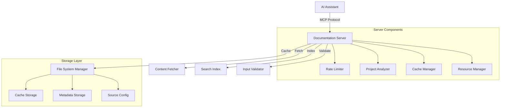

# MCP Codex Keeper: Technical Overview

## 🎯 Project Overview

MCP Codex Keeper is a specialized MCP server designed to provide AI assistants with efficient access to development documentation. It acts as a "knowledge guardian" that manages, indexes, and serves documentation while handling caching, updates, and search functionality.

## 🏗 Architecture

### Core Components



### Development Modes

1. **Development Mode**

   ```json
   {
     "mcpServers": {
       "local-mcp-codex-keeper": {
         "command": "node",
         "args": ["./build/index.js"],
         "env": {
           "NODE_ENV": "development"
         }
       }
     }
   }
   ```

   Features:

   - Local storage in project directory
   - Verbose logging
   - Hot reload support
   - Debug information
   - Memory profiling
   - Performance tracking

2. **Production Mode**

   ```json
   {
     "mcpServers": {
       "aindreyway-mcp-codex-keeper": {
         "command": "npx",
         "args": ["-y", "@aindreyway/mcp-codex-keeper@latest"],
         "env": {
           "NODE_ENV": "production"
         }
       }
     }
   }
   ```

   Features:

   - Global storage in user's home directory
   - Minimal logging
   - Optimized performance
   - Automatic updates via npx
   - Error recovery
   - Memory optimization

### Server Implementation

1. **Server Core** (`src/server.ts`)

   ```typescript
   class DocumentationServer {
     private server: Server;
     private fsManager: FileSystemManager;
     private docs: DocSource[] = [];
     private contentFetcher: ContentFetcher;
     private rateLimiter: RateLimiter;

     constructor() {
       this.rateLimiter = new RateLimiter({
         maxTokens: 100,
         refillRate: 10,
         refillInterval: 1000,
       });

       this.contentFetcher = new ContentFetcher({
         maxRetries: 3,
         retryDelay: 2000,
         timeout: 15000,
       });
     }

     async init(): Promise<void>;
     async run(): Promise<void>;
     private setupToolHandlers(): void;
     private setupResourceHandlers(): void;
   }
   ```

2. **File System Manager** (`src/utils/fs.ts`)

   ```typescript
   class FileSystemManager {
     private cache: CacheManager<string>;
     private basePath: string;
     private readonly maxSize: number;
     private readonly maxAge: number;

     constructor(options: { basePath: string; maxSize?: number; maxAge?: number }) {
       this.basePath = options.basePath;
       this.maxSize = options.maxSize ?? 1024 * 1024 * 100; // 100MB
       this.maxAge = options.maxAge ?? 24 * 60 * 60 * 1000; // 24 hours

       this.cache = new CacheManager({
         maxSize: this.maxSize,
         maxAge: this.maxAge,
         cleanupInterval: 60 * 60 * 1000, // 1 hour
       });
     }

     async saveDocumentation(name: string, content: string): Promise<void>;
     async loadDocumentation(name: string): Promise<string>;
     async searchInDocumentation(name: string, query: string): Promise<boolean>;
   }
   ```

## 💾 Storage System

### Directory Structure

```
.codexkeeper/
├── cache/           # Cached documentation
│   ├── [hash].html # Content files
│   └── [hash].meta # Metadata files
├── metadata/        # Document metadata
│   ├── index/      # Search indices
│   ├── stats/      # Usage statistics
│   └── config/     # Configuration
└── sources.json    # Source configuration
```

### Cache Implementation

1. **Cache Entry**

   ```typescript
   interface CacheEntry<T> {
     value: T; // Cached content
     size: number; // Content size
     hash: string; // Content hash
     lastAccessed: Date; // Last access time
     expires: Date; // Expiration time
     metadata: {
       // Additional metadata
       contentType: string;
       encoding: string;
       etag?: string;
       lastModified?: string;
     };
   }
   ```

2. **Cache Manager**

   ```typescript
   class CacheManager<T> {
     private store: Map<string, CacheEntry<T>>;
     private size: number = 0;
     private readonly maxSize: number;
     private readonly maxAge: number;

     constructor(options: CacheOptions) {
       this.maxSize = options.maxSize;
       this.maxAge = options.maxAge;
       this.cleanupInterval = options.cleanupInterval;

       // Start cleanup timer
       setInterval(() => this.cleanup(), this.cleanupInterval);
     }

     set(key: string, value: T, size: number): boolean;
     get(key: string): T | undefined;
     has(key: string): boolean;
     delete(key: string): boolean;
     clear(): void;

     private cleanup(): void;
     private evict(bytesNeeded: number): void;
   }
   ```

## 🔄 Development

### Building the Server

```bash
# Install dependencies
npm install

# Build the server
npm run build
```

This will:

1. Compile TypeScript files to JavaScript
2. Make the build/index.js executable
3. Copy necessary configuration files

### Rebuilding After Changes

When you make changes to the source code:

1. Run `npm run build` to rebuild the server
2. Restart any running MCP servers to apply changes

## 📦 Deployment & Publishing

### One-Command Deployment

```bash
npm run deploy
```

This command sequence:

- ✅ Builds the project
- ✅ Stages all changes
- ✅ Updates version numbers automatically
- ✅ Creates a git tag
- ✅ Publishes to npm
- ✅ Updates the repository

### Semantic Versioning

- MAJOR (x.0.0): Breaking changes
- MINOR (1.x.0): New features (backwards compatible)
- PATCH (1.0.x): Bug fixes

### Git Tags

```bash
# List tags
git tag

# Create tag
git tag -a v1.0.0 -m "Version 1.0.0"

# Push tags
git push --tags
```

### Post-Publication

1. Update documentation:

   - Update README.md with new features
   - Update PROJECT_SUMMARY.md
   - Update changelog if exists

2. Verify MCP integration:

   ```json
   {
     "mcpServers": {
       "your-server": {
         "command": "npx",
         "args": ["-y", "@yourusername/mcp-server-name@latest"]
       }
     }
   }
   ```

3. Test installation:

   ```bash
   # Clear npm cache
   npm cache clean --force

   # Test global installation
   npm install -g @yourusername/mcp-server-name@latest

   # Test with npx
   npx @yourusername/mcp-server-name@latest
   ```

### Troubleshooting Publication

1. Common Issues:

   - Package name conflicts
   - Version already exists
   - Missing files in package
   - Permission issues

2. Unpublish if needed (within 72h):

   ```bash
   npm unpublish @yourusername/mcp-server-name@1.0.0
   ```

3. Deprecate version:

   ```bash
   npm deprecate @yourusername/mcp-server-name@"1.0.0" "Critical bug found"
   ```

4. Check package contents:

   ```bash
   # View what will be published
   npm pack

   # Extract and inspect
   tar -xvf yourusername-mcp-server-name-1.0.0.tgz
   ```

## 🔧 Common Tasks

### Adding New Documentation Source

1. Add to defaultDocs in server.ts
2. Update DocCategory type if needed
3. Test with update_documentation tool

### Updating Cache Settings

- Check FileSystemManager in utils/fs.ts
- Cache duration in updateDocumentation method

### Adding New Features

1. Add types in types/index.ts
2. Add validation in validators/index.ts
3. Implement in server.ts
4. Update README.md

## 🎨 Design Decisions

1. Why TypeScript?

   - Type safety
   - Better IDE support
   - Easier maintenance

2. Why Local Cache?

   - Faster responses
   - Works offline
   - Reduces API calls

3. Why ES Modules?
   - Modern JavaScript
   - Better tree-shaking
   - Native async support

## 📝 Notes for Future Development

1. Potential Improvements:

   - Add rate limiting
   - Implement webhooks for updates
   - Add authentication
   - Support more document formats

2. Known Limitations:

   - Single-instance only
   - No real-time updates
   - Limited to HTML content

3. Future Ideas:
   - Add API documentation
   - Support for private docs
   - Multiple cache strategies
   - Plugin system

## 🤝 Maintenance Guidelines

1. Version Numbering:

   - Patch (1.0.x): Bug fixes
   - Minor (1.x.0): New features
   - Major (x.0.0): Breaking changes

2. Documentation Updates:

   - Keep README.md user-focused
   - Update this file for dev changes
   - Comment complex code sections

3. Testing:
   - Manual testing required
   - Check all tools work
   - Verify cache behavior
   - Test error handling

## 👥 For New Team Members

1. Start Here:

   - Read README.md first
   - Check package.json scripts
   - Understand src/types structure

2. Development Setup:

   - Node.js 18+
   - npm install
   - npm run dev for watch mode

3. Common Issues:
   - npm permissions (use chown)
   - Cache directory access
   - TypeScript compilation

Remember: This document should be updated as the project evolves!
